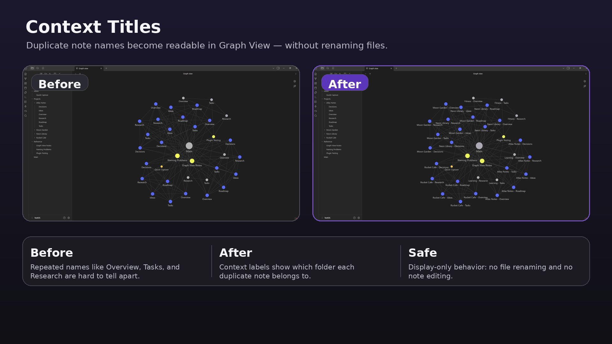
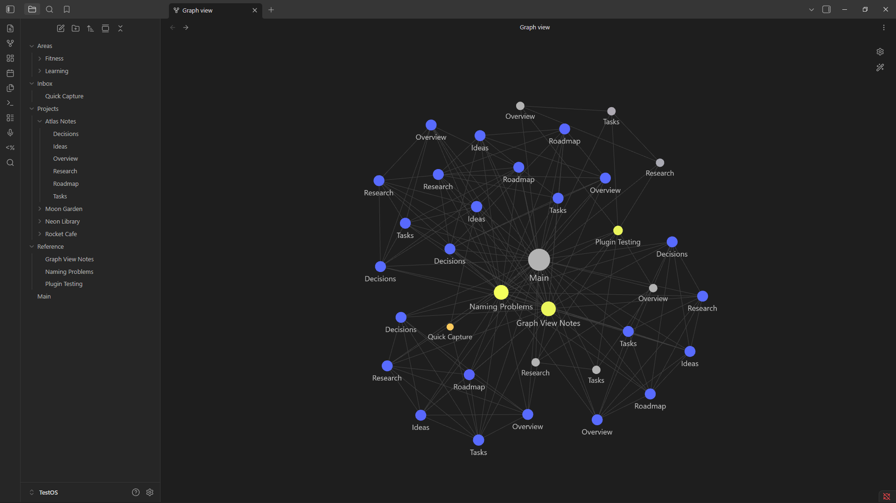
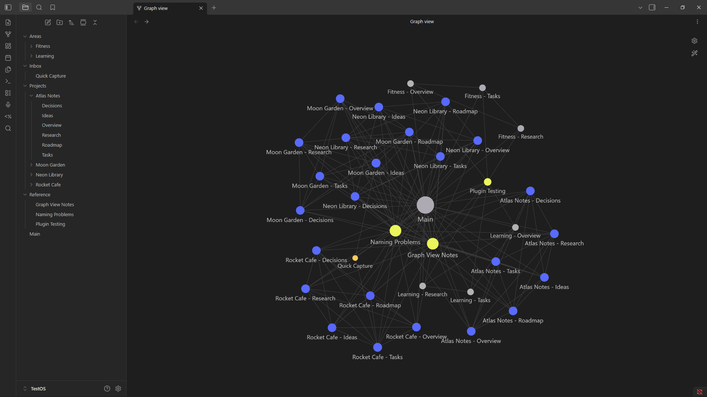
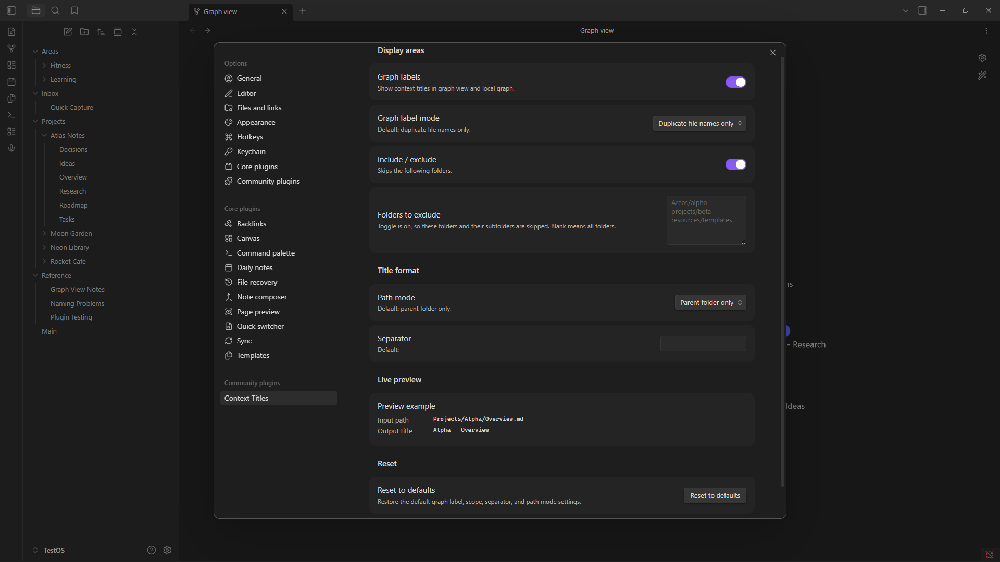

# Context Titles

Context Titles is an Obsidian community plugin that makes repeated note names easier to read in Graph View and Local Graph by adding folder context to the displayed label.

<p align="center">
  
</p>

```text
Projects/Alpha/Overview.md
-> Alpha - Overview
```

The real file stays `Overview.md`. Context Titles does not rename files, edit note contents, or require frontmatter titles.

## Smart unique labels

Context Titles normally uses the shortest configured folder context. If that still produces duplicate graph labels, it automatically adds another parent folder only to the labels that still collide.

For example:

```text
Projects/Alpha/Tasks.md
School/Alpha/Tasks.md

-> Projects - Alpha - Tasks
-> School - Alpha - Tasks
```

A third file that is already clear stays short:

```text
Projects/Gamma/Tasks.md
-> Gamma - Tasks
```

This fixes the case where two notes have both the same basename and the same immediate parent-folder name.

## Screenshots

### Before



### After



### Settings



## What works in v1.0.1

- Graph View and Local Graph display labels.
- Duplicate-only labeling by default.
- Automatic expansion to the shortest unique folder context when labels still collide.
- Optional labeling of every visible graph file.
- Include or exclude specific folder trees.
- Parent folder, full path, last 2 folders, and last 3 folders as the starting context depth.
- Custom separators.
- Built-in ignored folders for common non-note folders.
- Live settings preview.
- Commands to show the generated title for the active file and refresh graph labels.
- Settings normalization for older saved data.

## How path modes work

The selected path mode is the minimum context used for a graph label. Context Titles can expand beyond that minimum when necessary to keep duplicate labels unique.

- **Parent folder only**: starts with `Alpha - Tasks`.
- **Last 2 folders**: starts with `Projects - Alpha - Tasks`.
- **Last 3 folders**: starts with three folder levels when available.
- **Full path**: uses all available folder context.

For example, with `Parent folder only`, these two notes would initially both produce `Alpha - Tasks`:

```text
Projects/Alpha/Tasks.md
School/Alpha/Tasks.md
```

Context Titles detects that collision and expands them to:

```text
Projects - Alpha - Tasks
School - Alpha - Tasks
```

## Defaults

- Graph labels: enabled.
- Graph label mode: duplicate file names only.
- Separator: `-`, rendered with clean spacing as `Alpha - Overview`.
- Path mode: parent folder only, expanding when required for uniqueness.
- Built-in ignored folders: `Templates`, `Generated`, `Media`, `Attachments`.

Root files and files inside ignored folders keep their normal basename.

## Settings

Context Titles saves settings in the plugin's `data.json` file and normalizes invalid saved values back to defaults when the plugin loads.

- **Graph labels**: turns Graph View and Local Graph labeling on or off.
- **Graph label mode**: choose duplicate file names only or every visible graph file.
- **Include / exclude**: choose whether the listed folder trees are the only affected folders or folders to skip.
- **Folders to include/exclude**: vault-relative folder paths, one per line. Blank means all folders.
- **Separator**: text placed between folder context and the file name.
- **Path mode**: controls the minimum amount of folder context shown before automatic collision expansion.
- **Live preview**: shows the current generated output.
- **Reset to defaults**: restores the default graph-label, scope, separator, and path-mode settings.

Folder-scope paths are normalized for extra spaces, repeated slashes, trailing slashes, and Windows backslashes. Matching includes nested folders.

## What it does not do

- Does not rename files.
- Does not edit note contents.
- Does not require frontmatter titles.
- Does not change normal note headers, breadcrumbs, editor titles, or File Explorer labels.
- Does not modify Canvas files or search/backlink results.

## Current limitation

Obsidian does not expose a public Graph View label-provider API. Context Titles therefore uses an isolated runtime adapter for Graph View and Local Graph. The adapter changes graph renderer labels at display time and restores normal labels when the plugin unloads or graph labels are disabled.

Because that integration depends on Obsidian's internal graph renderer, future Obsidian changes may require maintenance.

Other display areas remain intentionally unsupported because they would require additional DOM or internal patching with relatively little benefit:

| Display area | v1.0.1 |
| --- | --- |
| Graph View | Supported |
| Local Graph | Supported |
| File Explorer | Not modified |
| Tabs / editor title / breadcrumbs | Not modified |
| Quick Switcher | Not modified |
| Search | Not modified |
| Backlinks / Outgoing Links | Not modified |
| Canvas cards | Not modified |

## Development

Install dependencies:

```bash
npm install
```

Run tests:

```bash
npm test
```

Run lint:

```bash
npm run lint
```

Build the plugin:

```bash
npm run build
```

Start watch mode:

```bash
npm run dev
```

The build writes `main.js` in the project root. Context Titles v1.0.1 requires Obsidian `1.13.0` or newer.

The repository also includes a GitHub Actions CI workflow that runs install, tests, build, and lint on pushes to `main` and on pull requests.

## Manual install in a dev vault

Do not develop or test plugins in your main vault. Use a separate Obsidian development vault.

1. Run `npm run build`.
2. Create `.obsidian/plugins/context-titles/` inside the dev vault.
3. Copy `main.js`, `manifest.json`, and `styles.css` into that folder.
4. Reload Obsidian.
5. Open Settings -> Community plugins.
6. Enable Context Titles.

## Useful manual test cases

Create notes such as:

```text
Projects/Alpha/Overview.md
Projects/Beta/Overview.md
Projects/Alpha/Tasks.md
School/Alpha/Tasks.md
Templates/Overview.md
Main.md
```

Then verify:

- `Projects/Alpha/Overview.md` and `Projects/Beta/Overview.md` display as `Alpha - Overview` and `Beta - Overview`.
- `Projects/Alpha/Tasks.md` and `School/Alpha/Tasks.md` expand to `Projects - Alpha - Tasks` and `School - Alpha - Tasks` instead of both displaying `Alpha - Tasks`.
- A unique visible file keeps its basename in duplicate-only mode.
- Files inside ignored or excluded folders keep their normal basename.
- Local Graph follows the same rules as Graph View.
- Changing the separator or path mode updates labels.
- Turning graph labels off restores normal labels.

## Official references

- Obsidian plugin build guide: https://docs.obsidian.md/Plugins/Getting+started/Build+a+plugin
- Official sample plugin: https://github.com/obsidianmd/obsidian-sample-plugin
- Obsidian API types: https://github.com/obsidianmd/obsidian-api
- Manifest docs: https://docs.obsidian.md/Reference/Manifest
